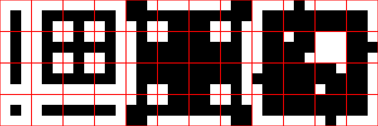
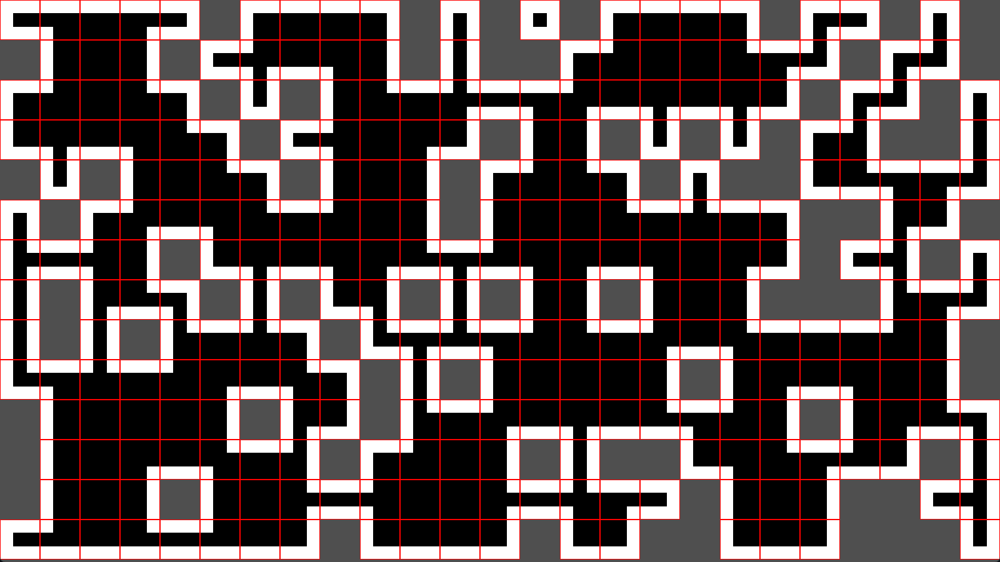

# cpp-autotile
please install [raincloud](https://github.com/scenent/raincloud) library to compile.

## warning
this algorithm is only available with the template image below(12 x 4, 48 - 1 tiles).
in AutoTile class, you can set cell size with constructor.

## screenshot

